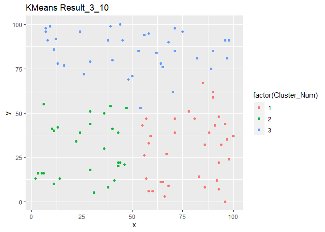
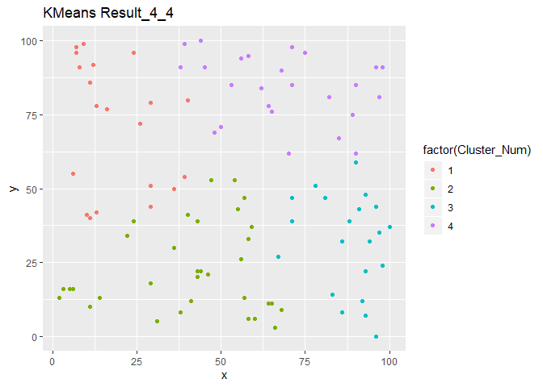
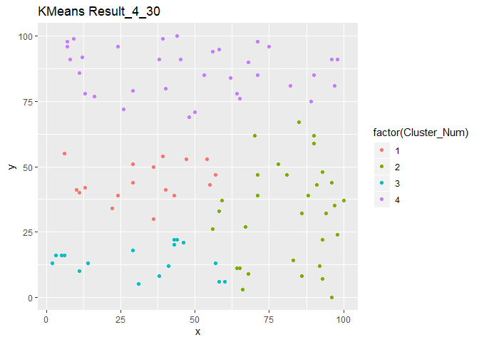

# 作业5

在MapReduce上实现K-Means算法并在小数据集上测试。  
可以使用附件的数据集，也可以随机生成若干散点的二维数据（x, y）  
要求用Matlab或者R语言等工具可视化散点图。设置不同的K值和迭代次数，可视化聚类结果。  
注：需提交代码和运行截图。

作业思路：参照课本示例代码，调整使其适应Hadoop新版本，得到输出后，利用R语言ggplot2绘图包，用不同颜色代表不同分类。图片名称中的第一个数字代表聚类个数，第二个数字代表迭代次数。

其中R语言画图部分是通过Rmd格式文件输出的，代码及结果附如下

``` r
library(ggplot2)
```

``` r
base = './outs/KMoutput'
iter_list = c(1,2,3,4,5,10,20,30,50)
for (i in 2:5){
  for (j in iter_list){
    k_num = as.character(i)
    iter_num = as.character(j)
    paras = paste(paste('_',k_num,sep=''),paste('_',iter_num,sep = ''),sep='')
    file = paste(base,paras,sep='')
    file = paste(file,'/clusteredInstances/part-m-00000',sep='')
    f = file(file,'r')
    df = data.frame()
    k = readLines(f)
    subsit = strsplit(sub(',','\t',k),'\t')
    for (l in subsit) {
      newline = t(as.integer(l))
      df = rbind(df,newline)
    }
    names(df)[names(df)=='V3']<-'Cluster_Num'
   plot=ggplot(df,mapping = aes(df$V1,df$V2,colour =factor(Cluster_Num) ))+geom_point()+ggtitle(paste('KMeans Result',paras,sep=''))+xlab('x')+ylab('y')
   print(plot)
   close(f)
  }
}
```


