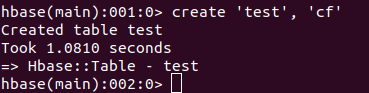

## 作业6--实验报告

1. 下载并安装HBase，尝试单机本地模式、伪分布式模式运行、集群模式（可选）。

2. 熟悉基本的HBase Shell操作。

3. 以伪分布式运行HBase，编写Java程序，创建讲义中的students表。

要求：撰写简单的实验报告，并提交代码和截图。

### 1. HBase安装（Standlone模式下测试）

安装HBase，思路是在已配置好Hadoop的Docker容器内加装HBase组件。本实验操作基本按照[官方指南](https://hbase.apache.org/book.html#quickstart)来进行。先启动一个原以单节点伪分布模式配置好的容器。

```bash
$ docker run -it --name hbase --hostname hbase yukho/fbdp2019:hadoop-singlenode /bin/bash
```

进入容器，先下载程序包，在使用清华镜像会快不少。

```bash
$ cd ~
$ wget https://mirrors.tuna.tsinghua.edu.cn/apache/hbase/2.2.2/hbase-2.2.2-bin.tar.gz
```

下载好之后，解压并进入相应文件夹。

```bash
$ tar xzvf hbase-2.2.2-bin.tar.gz
$ cd hbase-2.2.2
```

修改`conf/hbase-env.sh`，添加`JAVA_HOME`的配置：（此目录仅代表本环境）

```bash
$ vim conf/hbase-env.sh
```


```sh
export JAVA_HOME=/usr
```

修改`conf/hbase-site.xml`：

```xml
<configuration>
  <property>
    <name>hbase.rootdir</name>
    <value>file:///root/hbase</value>
  </property>
  <property>
    <name>hbase.zookeeper.property.dataDir</name>
    <value>/root/zookeeper</value>
  </property>
  <property>
    <name>hbase.unsafe.stream.capability.enforce</name>
    <value>false</value>
  </property>
</configuration>
```

因为这个镜像里已经配置过了`hdfs`，因此我们可以用`hdfs`模式的配置，主要在于`hbase.rootdir`：

```xml
  <property>
    <name>hbase.rootdir</name>
    <value>hdfs://localhost:9000/hbase</value>
  </property>
```

现在来启动试一试（记得要先启动HDFS和HBase主程序）：

```bash
$ ~/hadoop-3.2.1/sbin/start-all.sh
$ bin/start-hbase.sh
$ bin/hbase shell
```


接着跟着官方指引来熟悉一些操作：

创建一个表格：

```shell
>  create 'test', 'cf'
```



列出表格信息：

```shell
> list 'test'
```


列出表格详情：

```shell
> describe 'test'
```


向表格内插入数据：

```shell
> put 'test', 'row1', 'cf:a', 'value1'
> put 'test', 'row2', 'cf:b', 'value2'
> put 'test', 'row3', 'cf:c', 'value3'
```

第一条指令是在row1行，cf:a列，插入值value1。其中cf是列族。


扫描表格：

```shell
> scan 'test'
```


获取单列：

```shell
> get 'test', 'row1'
```


“禁用”和“启用”表格：

```shell
> disable 'test'
> enable 'test'
```


删除表格，删除之前需要先`disable`一下，否则将不成功：

```shell
> disable 'test'
> drop 'test'
```


离开shell，只需要用quit指令：

```shell
> quit
```

测试结束，把`hbase`关闭，还需要：

```shell
$ bin/stop-hbase.sh
```

关闭的过程需要一些时间，官方建议使用`jps`检查一下是否关闭完全。


### 2. HBase 伪分布模式配置

在已经配置好Standlone模式的这个容器里继续进行配置，到这一步我们希望能从浏览器访问到这个容器，所以保存下来重新启动一下，开放接口。

```shell
# 退出容器
$ exit
# 提交更改
$ docker commit -m="hbase-stdaln" hbase hbase
# 重新启动
$ docker stop hbase
$ docker rm hbase
$ docker run -it --name hbase -p 9870:9870 -p 8088:8088 -p 8020:8020 -p 10610:10610 hbase /bin/bash
```

首先，默认满足的条件是已经启动了HDFS。

然后，修改`hbase-site.xml`，设置以分布式模式启动，并将`hbase.rootdir`改在HDFS上：

```xml
<property>
  <name>hbase.cluster.distributed</name>
  <value>true</value>
</property>
<property>
  <name>hbase.rootdir</name>
  <value>hdfs://localhost:9000/hbase</value>
</property>
```

我们不需要手动建立`hbase`这个目录，它将会自动创建

现在启动一下看看：

```shell
$ bin/start-hbase.sh
```


可以看到`hbase`这个文件夹自动创建出来了：


检验一下能不能进行`shell`操作，操作与上一节基本一致，少量精简，没有遇到问题：


至此已经可以认为伪分布模式配置完成了。

现在配置一下IDEA使得它能够顺畅地调试HBase。

创建Maven项目与之前Hadoop调试相似，区别在于在`pom.xml`中引入`hbase`的依赖，此处仍然用2.2.2版本。

```xml
       <dependency>
            <groupId>org.apache.hbase</groupId>
            <artifactId>hbase-client</artifactId>
            <version>2.2.2</version>
        </dependency>
        <dependency>
            <groupId>org.apache.hbase</groupId>
            <artifactId>hbase-common</artifactId>
            <version>2.2.2</version>
        </dependency>
        <dependency>
            <groupId>org.apache.hbase</groupId>
            <artifactId>hbase-server</artifactId>
            <version>2.2.2</version>
        </dependency>
```

之后将`hbase-site.xml`配置文件，以及`log4j.properties`加入到Maven项目的Resource里面：


编写调用HBase Java API的代码。与课件里展示的API相比，此处更改了几个HBase 2.x版本更新的API，主要是创建Table和Column的方式。详见提交的代码`TryHbase.java`。

配置完成后运行代码，完成一个表格从创建、插入数据、查询、到最后删除的全过程，运行成功截图如下：


