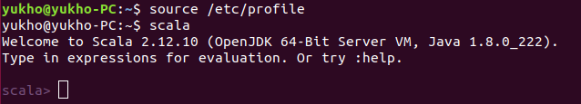
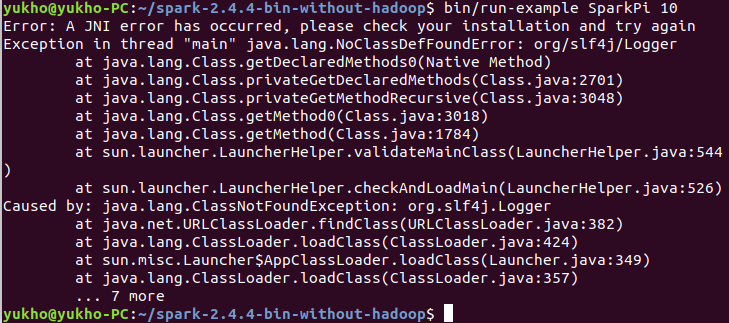

## 阶段3

阶段三任务（Spark编程）：

- 基于精简数据集完成Spark作业：
  - 统计各省销售最好的产品类别前十（销售最多前10的产品类别）
  - 统计各省的双十一前十热门销售产品（购买最多前10的产品）-- 和MapReduce作业对比结果
  - 查询双11那天浏览次数前十的品牌 -- 和Hive作业对比结果

### Spark安装

本次实验先在物理机上完成，后再上Docker配置Spark预编译包下载。

选择当前稳定的2.4.4版本Spark（[下载链接](http://mirrors.tuna.tsinghua.edu.cn/apache/spark/spark-2.4.4/spark-2.4.4-bin-without-hadoop.tgz)）或者

```shell
$ wget http://mirrors.tuna.tsinghua.edu.cn/apache/spark/spark-2.4.4/spark-2.4.4-bin-without-hadoop.tgz
```

然后跟之前的一样解压。

```shell
$ tar -xzvf spark-2.4.4-bin-without-hadoop.tgz
```

按照官网上说的，还需要安装好Scala，挺神奇的，说Spark 2.4.4是由Scala来pre-build的但是编程要用Scala 2.12 API编程。[Scala 2.12.10下载](https://downloads.lightbend.com/scala/2.12.10/scala-2.12.10.tgz)

```shell
$ wget https://downloads.lightbend.com/scala/2.12.10/scala-2.12.10.tgz
$ tar -xzvf scala-2.12.10.tgz
```

然后将Scala添加到环境变量：

```shell
$ sudo vim /etc/profile
```

在文件末尾：

```sh
export PATH="$PATH:$SCALA_HOME/bin"
export SCALA_HOME="/home/yukho/scala-2.12.10"
```

试一试有没有安装成功：

```shell
$ source /etc/profile
$ scala
```



Scala安装完成了，现在再来试一试Spark能否正常启动了：

```shell
$ cd ~/spark-2.4.4-bin-without-hadoop/
$ bin/run-example SparkPi 10
```

似乎不太行……报错：



原因似乎在于没有配置spark-env.sh，要在Spark安装目录下conf文件夹里，按照spark-env.sh.template的提示，新建一个spark-env.sh文件，并在里面插入：


```sh
export SCALA_HOME=/home/yukho/scala-2.12.10
export HADOOP_HOME=/home/yukho/hadoop-3.2.1
export HADOOP_CONF_DIR=/home/yukho/hadoop-3.2.1/etc/hadoop
export SPARK_DIST_CLASSPATH=$(/home/yukho/hadoop-3.2.1/bin/hadoop classpath)
```

再来试试：


看到跑出了结果，应该就算正常了～接着我们可以来用shell了：

```shell
bin/spark-shell --master local
```

有点奇怪，无论如何都会报错，但能进入shell模式，不过用的会是自带的Scala而不是系统里安装的。

看上去不影响后续实验，就先不管了。求知道原因和解决办法的同学分享一下咋回事……


先不管那么多了，试一试运行起来怎么样吧！

我们就基于这个scala语言的shell写一些命令来完成我们的任务看看：

##### 统计各省销售最好的产品类别前十（销售最多前10的产品类别）

```scala
val file = sc.textFile("file:///home/yukho/fbdp_data/million_user_log.csv")
val buyPart = file.filter(_.split(",")(7)=="2").map(x=>((x.split(",")(10),x.split(",")(2)),1)).reduceByKey(_+_)
val mapPro = buyPart.map(x=>(x._1._1,(x._1._2,x._2))).groupByKey()
val sortPro = mapPro.map(x=>(x._1,(x._2.toList.sortWith(_._2>_._2).take(10))))
val sortResult = sortPro.foreach(v => {
    println()
    print(v._1 + " : ")
    v._2.foreach(result=>print(result))
    println()
})
```

结果如下：


##### 统计各省的双十一前十热门销售产品（购买最多前10的产品）-- 和MapReduce作业对比结果

```scala
val file = sc.textFile("file:///home/yukho/fbdp_data/million_user_log.csv")
val buyPart = file.filter(_.split(",")(7)=="2").map(x=>((x.split(",")(10),x.split(",")(1)),1)).reduceByKey(_+_)
val mapPro = buyPart.map(x=>(x._1._1,(x._1._2,x._2))).groupByKey()
val sortPro = mapPro.map(x=>(x._1,(x._2.toList.sortWith(_._2>_._2).take(10))))
val sortResult = sortPro.foreach(v => {
    println()
    print(v._1 + " : ")
    v._2.foreach(result=>print(result))
    println()
})
```

结果如下：


与MapReduce结果对比：

输出商品以及数量皆完全一致，但是程序实在是简短了太多……。

##### 查询双11那天浏览次数前十的品牌 -- 和Hive作业对比结果:

```scala
val file = sc.textFile("file:///home/yukho/fbdp_data/million_user_log.csv")
val viewPart = file.filter(_.split(",")(7)=="0").map(x=>(x.split(",")(4),1)).reduceByKey(_+_)
val sortPdt = viewPart.top(10)(Ordering.by(_._2))
```

结果如下：


再次，结果与Hive的结果完全一致，逻辑比Hive要稍微清楚一点。