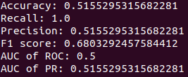
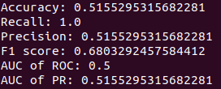
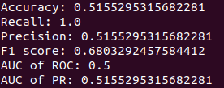
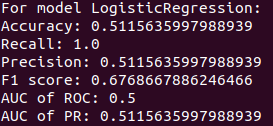
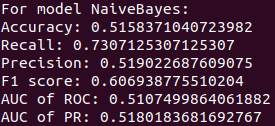
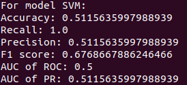
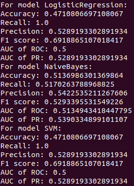
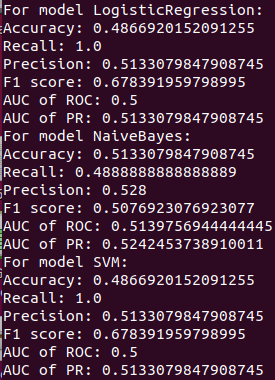
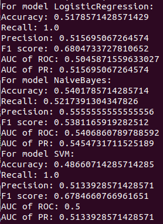

## 阶段4

阶段四任务（数据挖掘）：

- 针对预处理后的训练集和测试集，基于MapReduce或Spark MLlib编写程序预测回头客
- 评估预测准确率（可选）

回头客训练集train.csv和回头客测试集test.csv，训练集和测试集拥有相同的字段，字段定义如下：

1. user_id | 买家id 
2. age_range | 买家年龄分段：1表示年龄<18,2表示年龄在[18,24]，3表示年龄在[25,29]，4表示年龄在[30,34]，5表示年龄在[35,39]，6表示年龄在[40,49]，7和8表示年龄>=50，0和NULL则表示未知 
3. gender | 性别:0表示女性，1表示男性，2和NULL表示未知 
4. merchant_id | 商家id 
5. label | 是否是回头客，0值表示不是回头客，1值表示回头客，-1值表示该用户已经超出我们所需要考虑的预测范围。NULL值只存在测试集，在测试集中表示需要预测的值。

训练集（train_after.csv）和测试集（test_after.csv）的预处理如下：

1. 预先处理test.csv数据集，把test.csv数据集里label字段表示-1值剔除掉，保留需要预测的数据，并假设需要预测的数据中label字段均为1；

2. train.csv的第一行都是字段名称，不需要第一行字段名称，这里在对train.csv做数据预处理时，删除第一行，然后剔除掉train.csv中字段值部分字段值为空的数据。

#### 实验思路：

首先明确任务的目标：分类。判断仔细观察数据集，user_id本无意义，不可成为用户特征的量化。age_range，gender都属于用户个人的标签，自然是及其重要。至于merchant_id，经统计1000条记录里共有1594个不同的merchant_id，或许在哪家买的东西一定程度上会影响商人是否成为回头客，可以一试。

根据以上推理，我们分别以“年龄、性别”和“年龄、性别、商家”为输入，通过调用合适的机器学习算法，拟合，分别得出预测模型及评估模型的绩效。

在训练模型之前，先将数据集导入，通过描述性统计获得这个数据集的一些基本特征。我们容易发现，训练集里，回头客标签的正负样本比例极其不均衡。这会给模型带来很大问题。如果直接全样本输入，大多数模型的输出都是清一色的**0**，这显然是不科学的，这部分结果就不贴了。

因此处我们采取**过采样**，和**欠采样**的方法来缓解这个问题。

过采样：将正样本复制17次追加到样本集里。

欠采样：从负样本中抽取跟正样本数量一致的样本，合起来再训练。

同样地，我们写出脚本语句直接在spark-shell中操作。

> TRY 1、用Logistic回归，以用户年龄和性别作为输入

```scala
import org.apache.spark.mllib.linalg.Vectors
import org.apache.spark.mllib.regression.LabeledPoint
import org.apache.spark.mllib.classification.LogisticRegressionWithSGD
import org.apache.spark.mllib.evaluation.BinaryClassificationMetrics
var data =sc.textFile("file:///home/yukho/fbdp_data/train_after.csv")
val overSampling = data.filter(_.split(",")(4)=="1")
var i = 0
for( i <- 1 to 17){
    data = data.union(overSampling)
} 
val labeledData = data.map{ line=>
    val parts = line.split(",")
    LabeledPoint(parts(4).toDouble, Vectors.dense(parts(1).toDouble,parts(2).toDouble))
}.cache().randomSplit(Array(0.8,0.2))
val train=labeledData(0).cache()
val test=labeledData(1).cache()
val model = LogisticRegressionWithSGD.train(train,500)
val scoreAndLabels= test.map(line=>(model.predict(line.features), line.label)).cache()
val metrics = new BinaryClassificationMetrics(scoreAndLabels)
val accuracy = scoreAndLabels.filter(x=>x._1==x._2).count.toDouble / test.count.toDouble
val pr=metrics.pr().collect()(1)
val recall=pr._1
val precision=pr._2
val f1Score=metrics.fMeasureByThreshold().collect()(0)._2
val aucROC=metrics.areaUnderROC()
val aucPR=metrics.areaUnderPR()
println("Accuracy: "+accuracy+"\nRecall: "+recall+"\nPrecision: "+precision+"\nF1 score: "+f1Score+"\nAUC of ROC: "+aucROC+"\nAUC of PR: "+aucPR)
```

结果评价如下，似乎有点诡异：



> TRY 2：分别换成朴素贝叶斯和支持向量机，以用户年龄和性别作为输入，进行训练。在运行过上面命令的基础上：

```scala
import org.apache.spark.mllib.classification.{NaiveBayes,SVMWithSGD}
val model = NaiveBayes.train(train)
val model2 = SVMWithSGD.train(train,500)
//Run codes below twice, with model and model2 as "the model" respectively.
val scoreAndLabels= test.map(line=>(model2.predict(line.features), line.label)).cache()
val metrics = new BinaryClassificationMetrics(scoreAndLabels)
val accuracy = scoreAndLabels.filter(x=>x._1==x._2).count.toDouble / test.count.toDouble
val pr=metrics.pr().collect()(1)
val recall=pr._1
val precision=pr._2
val f1Score=metrics.fMeasureByThreshold().collect()(0)._2
val aucROC=metrics.areaUnderROC()
val aucPR=metrics.areaUnderPR()
println("Accuracy: "+accuracy+"\nRecall: "+recall+"\nPrecision: "+precision+"\nF1 score: "+f1Score+"\nAUC of ROC: "+aucROC+"\nAUC of PR: "+aucPR)
```

结果如下（左贝叶斯，右SVM）：没错……就是完 全 一 致！



这显然是有问题的！其实很容易就发现了，这里预测把所有label都预测成1了……这也不怪训练器，想必是数据集的问题……。那么我们只好再试试加入商家ID之后的情况吧！这次我们把代码写成一体，便于输出结果。

> TRY 3：增加商家id作为输入指标，再试试看。

```scala
import org.apache.spark.mllib.linalg.Vectors
import org.apache.spark.mllib.regression.LabeledPoint
import org.apache.spark.mllib.classification.{LogisticRegressionWithSGD,NaiveBayes,SVMWithSGD}
import org.apache.spark.mllib.evaluation.BinaryClassificationMetrics

def getEvaluates(metrics:BinaryClassificationMetrics,accuracy:Double, name:String){
    println("For model "+name+":")
    val pr=metrics.pr().collect()(1)
    val recall=pr._1
    val precision=pr._2
    val f1Score=metrics.fMeasureByThreshold().collect()(0)._2
    val aucROC=metrics.areaUnderROC()
    val aucPR=metrics.areaUnderPR()
    println("Accuracy: "+accuracy+"\nRecall: "+recall+"\nPrecision: "+precision+"\nF1 score: "+f1Score+"\nAUC of ROC: "+aucROC+"\nAUC of PR: "+aucPR)
}
// Prepare data: over sampling
var data =sc.textFile("file:///home/yukho/fbdp_data/train_after.csv")
val overSampling = data.filter(_.split(",")(4)=="1")
var i = 0
for( i <- 1 to 17){
    data = data.union(overSampling)
} 
val labeledData = data.map{ line=>
    val parts = line.split(",")
    LabeledPoint(parts(4).toDouble, Vectors.dense(parts(1).toDouble,parts(2).toDouble,parts(3).toDouble))
}.cache().randomSplit(Array(0.8,0.2))
// Train and evaluate
val train=labeledData(0).cache()
val test=labeledData(1).cache()
val model1 = LogisticRegressionWithSGD.train(train,500)
val model2 = NaiveBayes.train(train)
val model3 = SVMWithSGD.train(train,500)
val scoreAndLabels1= test.map(line=>(model1.predict(line.features), line.label)).cache()
val scoreAndLabels2= test.map(line=>(model2.predict(line.features), line.label)).cache()
val scoreAndLabels3= test.map(line=>(model3.predict(line.features), line.label)).cache()
val metrics1 = new BinaryClassificationMetrics(scoreAndLabels1)
val metrics2 = new BinaryClassificationMetrics(scoreAndLabels2)
val metrics3 = new BinaryClassificationMetrics(scoreAndLabels3)
val accuracy1= scoreAndLabels1.filter(x=>x._1==x._2).count.toDouble / test.count.toDouble
val accuracy2 = scoreAndLabels2.filter(x=>x._1==x._2).count.toDouble / test.count.toDouble
val accuracy3 = scoreAndLabels3.filter(x=>x._1==x._2).count.toDouble / test.count.toDouble
{getEvaluates(metrics1, accuracy1, "LogisticRegression")
getEvaluates(metrics2, accuracy2, "NaiveBayes")
getEvaluates(metrics3, accuracy3, "SVM")}
```







震惊……除了朴素贝叶斯，那是一点都没有长进啊……

这可咋整……要不再把用户id也加上去试试，看看会不会有什么神秘关联？（仅给出代码与上面不同之处）

> TRY 4：增加用户id作为输入指标，再试试看。

```scala
// Origin:
val labeledData = data.map{ line=>
    val parts = line.split(",")
    LabeledPoint(parts(4).toDouble, Vectors.dense(parts(1).toDouble,parts(2).toDouble,parts(3).toDouble))
}.cache().randomSplit(Array(0.8,0.2))

// Modified:
val labeledData = data.map{ line=>
    val parts = line.split(",")
    LabeledPoint(parts(4).toDouble, Vectors.dense(parts(0).toDouble,parts(1).toDouble,parts(2).toDouble,parts(3).toDouble))
}.cache().randomSplit(Array(0.8,0.2))
```

很可惜，结果是一样的……



换一个思路，刚刚都是过采样，那要不欠采样一下，看看有没有用？

> TRY 5：取所有正样本以及数量相同的负样本，来做训练。

```scala
// Origin
var data =sc.textFile("file:///home/yukho/fbdp_data/train_after.csv")
val positiveSample = data.filter(_.split(",")(4)=="1")
var i = 0
for( i <- 1 to 17){
    data = data.union(overSampling)
} 
// Modified:
val dataInput =sc.textFile("file:///home/yukho/fbdp_data/train_after.csv")
val positiveSample = dataInput.filter(_.split(",")(4)=="1")
val negativeSample = spark.sparkContext.parallelize(dataInput.filter(_.split(",")(4)=="0").takeSample(false,positiveSample.count.toInt))
val data = positiveSample.union(negativeSample)
```

从结果看来……并无起色……



不过偶尔也能行一点……



#### 附加实验

除了用MLlib，我也尝试了一下ml库的操作。与MLlib对比起来，ml是基于dataframe的操作，抽象层次更高一点，使用起来更接近于Python Pandas或者R的DataFrame了，还是比较舒适的，这里贴一部分读入数据、输入并训练的代码，结果评价大同小异且意义不太大了，不再赘述。

```scala
import org.apache.spark.sql.types._
import org.apache.spark.ml.feature.VectorAssembler
import org.apache.spark.ml.classification.{GBTClassifier,LinearSVC,LogisticRegression,NaiveBayes,RandomForestClassifier,ProbabilisticClassifier}
val the_header = StructType(
	StructField("user_id", LongType)::
    StructField("age_range", IntegerType)::
    StructField("gender", IntegerType)::
    StructField("merchant_id", LongType)::
    StructField("label", IntegerType)::
    Nil
)
val df_train = spark.read.format("csv").schema(the_header).option("header",false).load("file:///home/yukho/fbdp_data/train_after.csv")
// 使用 VectorAssembler集成输入特征，作用类似MLlib的LabelPoint方法
val assembler = new VectorAssembler().setInputCols(Array("age_range","gender","merchant_id")).setOutputCol("features")
val df = assembler.transform(df_train)
val Array(train,test) = df.randomSplit(Array(0.8,0.2))
val gbtc = new GBTClassifier()
val modelGBTC = gbtc.fit(train)
modelGBTC.transform(test).show()
```


## 总结

如果出现准确率达到90%+，那估计是因为在整个训练集上，全部预测为负样本，获得一个94.32%的表现，显然这种是不可靠的。

但是将数据集转换成平衡集之后，仍然准确率只能在50%稍微往上，模型优化空间固然还是有的，但估计最大的问题还是数据集本身没有有效的特征，或者说特征与标签之间确实没有太大的关联，那么预测效果不好也能理解。

如果说这次实验的目的只是为了走一遍Spark机器学习的流程的话，那么实验目的还是成功达到了的。